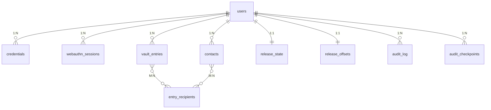

# 04 - Data Model

Postgres schema. Migrations managed by `goose` (version in `goose_db_version`). Query SQL lives in `backend/internal/store/queries/*.sql`, compiled to typed Go by `sqlc`.

## 1. Conventions

- **Identifiers** are UUIDv7 unless otherwise noted (sortable, time-ordered).
- **Timestamps** are `timestamptz`, stored in UTC.
- **Soft delete** is implemented via a nullable `deleted_at` column. Queries on active records filter `WHERE deleted_at IS NULL`.
- **Foreign keys** use `ON DELETE` rules explicitly stated per relationship.
- **Indexes** are documented per table; non-obvious indexes have a rationale comment.
- **No personally identifiable plaintext** in any table except `users.email` and `contacts.email` (necessary for outbound notifications).

## 2. Schema overview



Standalone: `jobs` (async work queue). Migration bookkeeping in `goose_db_version` (managed by `goose`).

## 3. Migrations

Three migration groups:

- **1 - Auth** (`migrations/0001_auth.sql`): `users`, `credentials`, `webauthn_sessions`.
- **2 - Vault and contacts** (`migrations/0002_vault_contacts.sql`): `vault_entries`, `contacts`, `entry_recipients`.
- **3 - Release and audit** (`migrations/0003_release_audit.sql`): `release_state`, `release_offsets`, `audit_log`, `audit_checkpoints`, `jobs`.

## 4. Table specifications

### 4.1 `users`

```sql
CREATE TABLE users (
    id              UUID PRIMARY KEY,
    email           TEXT NOT NULL UNIQUE,
    display_name    TEXT NOT NULL,
    created_at      TIMESTAMPTZ NOT NULL DEFAULT now(),
    deleted_at      TIMESTAMPTZ
);

CREATE INDEX users_email_active_idx ON users(email) WHERE deleted_at IS NULL;
```

Email is required for outbound notifications (release reminders, contact invitations). Email is hashed in audit log entries to avoid plaintext logging.

### 4.2 `credentials`

WebAuthn passkey credentials registered by a user. A user may have multiple credentials (one per device, plus optional hardware keys).

```sql
CREATE TABLE credentials (
    id            BYTEA PRIMARY KEY,             -- raw credential ID from WebAuthn
    user_id       UUID NOT NULL REFERENCES users(id) ON DELETE CASCADE,
    public_key    BYTEA NOT NULL,                -- COSE public key
    sign_count    BIGINT NOT NULL DEFAULT 0,
    transports    TEXT[],                        -- e.g., ["internal", "hybrid"]
    aaguid        UUID,                          -- authenticator AAGUID, optional
    age_recipient TEXT NOT NULL,                 -- bech32-encoded age recipient
    nickname      TEXT NOT NULL,                 -- user-provided device label
    created_at    TIMESTAMPTZ NOT NULL DEFAULT now(),
    last_used_at  TIMESTAMPTZ,
    deleted_at    TIMESTAMPTZ
);

CREATE INDEX credentials_user_active_idx ON credentials(user_id) WHERE deleted_at IS NULL;
```

`age_recipient` stores the user's age public key derived from the PRF output for that credential. Multiple credentials produce different age recipients only when the credentials are not synced; platform-synced passkeys produce a consistent recipient across devices.

### 4.3 `webauthn_sessions`

Short-lived ceremony state. Each row holds the JSON-marshalled go-webauthn `SessionData`, keyed by a UUID that is also written to a `lgv_webauthn_session` cookie scoped to `/api/v1/auth`. The verify step consumes the row and clears the cookie.

```sql
CREATE TABLE webauthn_sessions (
    id           UUID PRIMARY KEY,
    user_id      UUID REFERENCES users(id) ON DELETE CASCADE,  -- nullable schema, always populated in practice
    session_data BYTEA NOT NULL,                                -- json-encoded go-webauthn SessionData
    purpose      TEXT NOT NULL CHECK (purpose IN ('register', 'login')),
    expires_at   TIMESTAMPTZ NOT NULL,
    consumed_at  TIMESTAMPTZ
);

CREATE INDEX webauthn_sessions_expires_idx ON webauthn_sessions(expires_at);
```

5-minute TTL. Consume filters `consumed_at IS NULL AND expires_at > now()`; expired rows are inert.

### 4.4 `vault_entries`

Encrypted vault entries, stored as two blobs per entry.

```sql
CREATE TABLE vault_entries (
    id              UUID PRIMARY KEY,
    user_id         UUID NOT NULL REFERENCES users(id) ON DELETE CASCADE,
    preview         BYTEA NOT NULL,                    -- age-encrypted {label, schemaVersion}, returned by list
    bundle          BYTEA NOT NULL,                    -- age-encrypted zip bundle of one or more files, fetched on open
    sort_order      INTEGER NOT NULL DEFAULT 0,
    schema_version  SMALLINT NOT NULL DEFAULT 1,
    created_at      TIMESTAMPTZ NOT NULL DEFAULT now(),
    updated_at      TIMESTAMPTZ NOT NULL DEFAULT now(),
    deleted_at      TIMESTAMPTZ
);

CREATE INDEX vault_entries_user_active_idx ON vault_entries(user_id, sort_order)
  WHERE deleted_at IS NULL;
```

The label is encrypted inside `preview`. `schema_version` allows wire-format upgrades.

### 4.5 `contacts`

Designated recipients for a user's vault.

```sql
CREATE TABLE contacts (
    id                  UUID PRIMARY KEY,
    user_id             UUID NOT NULL REFERENCES users(id) ON DELETE CASCADE,
    email               TEXT NOT NULL,
    display_name        TEXT NOT NULL,
    status              TEXT NOT NULL CHECK (status IN ('pending', 'verified', 'removed'))
                            DEFAULT 'pending',
    contact_user_id     UUID REFERENCES users(id) ON DELETE SET NULL,  -- if contact has registered
    age_recipient       TEXT,                                          -- contact's age public key
    fingerprint_hash    BYTEA,                                         -- BLAKE2b of recipient + label
    invited_at          TIMESTAMPTZ NOT NULL DEFAULT now(),
    verified_at         TIMESTAMPTZ,
    removed_at          TIMESTAMPTZ
);

CREATE INDEX contacts_user_status_idx ON contacts(user_id, status);
CREATE INDEX contacts_email_user_idx ON contacts(user_id, email);
```

Contact lifecycle:

1. Owner adds -> row inserted with `status='pending'`.
2. Contact accepts invitation, registers their passkey, submits `age_recipient` and fingerprint hash.
3. Owner verifies fingerprint out-of-band, calls approve endpoint -> `status='verified'`, `verified_at` set.
4. Owner removes -> `status='removed'`, `removed_at` set; entries no longer encrypt to this recipient.

### 4.6 `entry_recipients`

Many-to-many: which contacts are designated recipients of which entries.

```sql
CREATE TABLE entry_recipients (
    entry_id        UUID NOT NULL REFERENCES vault_entries(id) ON DELETE CASCADE,
    contact_id      UUID NOT NULL REFERENCES contacts(id) ON DELETE CASCADE,
    assigned_at     TIMESTAMPTZ NOT NULL DEFAULT now(),
    PRIMARY KEY (entry_id, contact_id)
);

CREATE INDEX entry_recipients_contact_idx ON entry_recipients(contact_id);
```

Reassignment is implemented by deleting old rows and inserting new ones in a transaction. The corresponding `vault_entries.preview` and `vault_entries.bundle` are updated in the same transaction with the freshly-encrypted blobs.

### 4.7 `release_state`

Per-user inactivity tracking and state-machine state.

```sql
CREATE TABLE release_state (
    user_id             UUID PRIMARY KEY REFERENCES users(id) ON DELETE CASCADE,
    state               TEXT NOT NULL CHECK (state IN (
                            'ACTIVE',
                            'REMINDED_SOFT',
                            'REMINDED_FIRM',
                            'REMINDED_FINAL',
                            'COOLING',
                            'FINAL_HOLD',
                            'RELEASED'
                        )) DEFAULT 'ACTIVE',
    last_checkin_at     TIMESTAMPTZ NOT NULL DEFAULT now(),
    state_entered_at    TIMESTAMPTZ NOT NULL DEFAULT now(),
    cooling_started_at  TIMESTAMPTZ,
    final_hold_until    TIMESTAMPTZ,
    is_false_positive   BOOLEAN NOT NULL DEFAULT false
);
```

The state machine and transition rules are specified in [Release Orchestration](06-release-orchestration.md).

### 4.8 `release_offsets`

Configurable timing parameters per user.

```sql
CREATE TABLE release_offsets (
    user_id             UUID PRIMARY KEY REFERENCES users(id) ON DELETE CASCADE,
    soft_after_days     INTEGER NOT NULL DEFAULT 7,
    firm_after_days     INTEGER NOT NULL DEFAULT 14,
    final_after_days    INTEGER NOT NULL DEFAULT 30,
    cooling_hours       INTEGER NOT NULL DEFAULT 48,
    final_hold_hours    INTEGER NOT NULL DEFAULT 24
);
```


### 4.9 `audit_log`

Hash-chained activity log.

```sql
CREATE TABLE audit_log (
    id                  UUID PRIMARY KEY,
    user_id             UUID NOT NULL REFERENCES users(id) ON DELETE CASCADE,
    sequence            BIGINT NOT NULL,                       -- per-user monotonic sequence
    event_type          TEXT NOT NULL,                         -- e.g., 'login', 'entry_create', 'release_state_change'
    payload             JSONB NOT NULL,                        -- event details (no plaintext secrets)
    prev_entry_hash     BYTEA NOT NULL,                        -- BLAKE2b(prev entry serialized)
    created_at          TIMESTAMPTZ NOT NULL DEFAULT now(),
    UNIQUE (user_id, sequence)
);

CREATE INDEX audit_log_user_sequence_idx ON audit_log(user_id, sequence);
```

Hash chain: `prev_entry_hash = BLAKE2b("legavi.audit-chain.v1", canonical_serialize(prev_entry))`. The first entry per user has `prev_entry_hash = BLAKE2b(domain_tag || user_id)`.

### 4.10 `audit_checkpoints`

Owner-signed chain head signatures.

```sql
CREATE TABLE audit_checkpoints (
    id              UUID PRIMARY KEY,
    user_id         UUID NOT NULL REFERENCES users(id) ON DELETE CASCADE,
    sequence        BIGINT NOT NULL,                           -- references audit_log.sequence
    chain_head_hash BYTEA NOT NULL,
    signature       BYTEA NOT NULL,                            -- Ed25519 signature over chain_head_hash + sequence
    signed_at       TIMESTAMPTZ NOT NULL DEFAULT now(),
    UNIQUE (user_id, sequence)
);

CREATE INDEX audit_checkpoints_user_sequence_idx ON audit_checkpoints(user_id, sequence DESC);
```

Checkpoint cadence and verification per [Crypto Spec section 5](02-crypto-spec.md#5-audit-log).

### 4.11 `jobs`

Generic async work queue.

```sql
CREATE TABLE jobs (
    id              UUID PRIMARY KEY,
    type            TEXT NOT NULL,
    payload         JSONB NOT NULL,
    run_after       TIMESTAMPTZ NOT NULL DEFAULT now(),
    attempts        INTEGER NOT NULL DEFAULT 0,
    max_attempts    INTEGER NOT NULL DEFAULT 5,
    status          TEXT NOT NULL CHECK (status IN ('pending', 'running', 'completed', 'failed'))
                        DEFAULT 'pending',
    locked_by       TEXT,                                      -- worker ID
    locked_at       TIMESTAMPTZ,
    completed_at    TIMESTAMPTZ,
    last_error      TEXT,
    dedup_key       TEXT,
    UNIQUE (dedup_key)
);

CREATE INDEX jobs_pending_idx ON jobs(run_after) WHERE status = 'pending';
CREATE INDEX jobs_locked_idx ON jobs(locked_by) WHERE status = 'running';
```

Workers claim jobs with `UPDATE ... WHERE status = 'pending' AND run_after <= now() ... RETURNING ...` using `FOR UPDATE SKIP LOCKED` semantics. `dedup_key` prevents duplicate event handling.

## 5. Retention

- Vault data retained until the user explicitly deletes their account. Audit log retained for the user's lifetime; not pruned unless requested.
- Soft-deleted entries restorable for 30 days, hard-purged thereafter by a periodic job.
