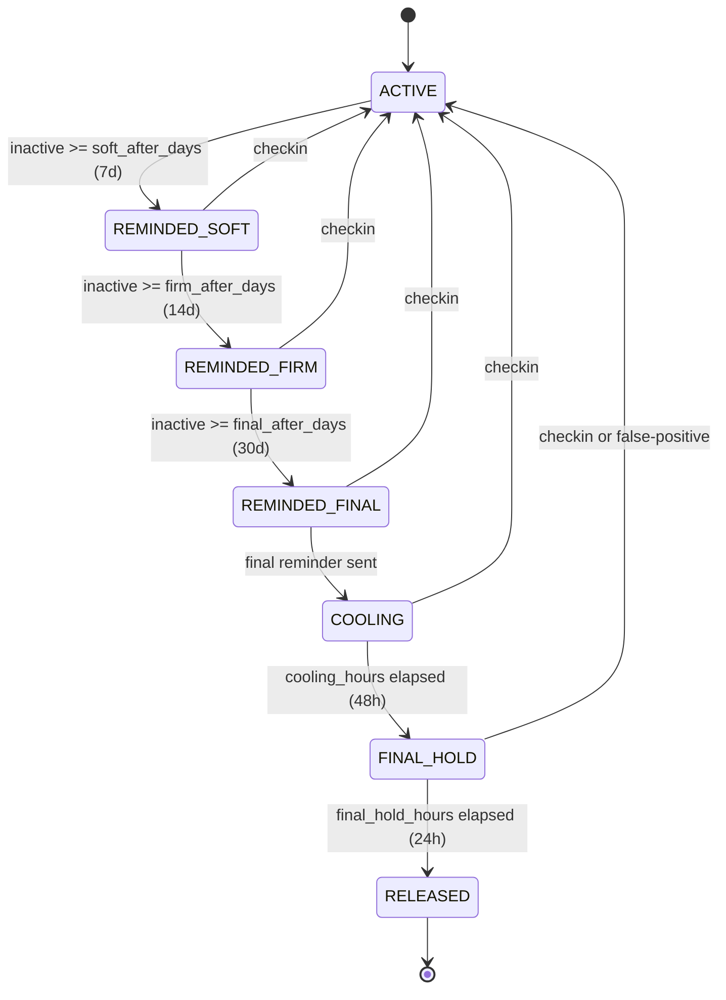

# 06 - Release Orchestration

Inactivity-detection state machine and the release process. The state machine must be deterministic, recoverable, and verifiable.

## 1. State diagram

## 2. State definitions

| State            | Description                                                                            | Owner can cancel?                                               | Recipients receive? |
| ---------------- | -------------------------------------------------------------------------------------- | --------------------------------------------------------------- | ------------------- |
| `ACTIVE`         | Normal operation.                                                                      | N/A                                                             | No                  |
| `REMINDED_SOFT`  | Soft reminder sent (configurable cadence; default 7 days inactive).                    | Yes (checkin)                                                   | No                  |
| `REMINDED_FIRM`  | Firm reminder sent (default 14 days inactive).                                         | Yes (checkin)                                                   | No                  |
| `REMINDED_FINAL` | Final reminder sent (default 30 days inactive).                                        | Yes (checkin)                                                   | No                  |
| `COOLING`        | Final reminder elapsed without check-in. 48-hour cooling period before formal release. | Yes (checkin)                                                   | Notification only   |
| `FINAL_HOLD`     | Cooling expired. 24-hour final hold during which owner can still flag false-positive.  | Yes (false-positive flag, which also revokes any tokens issued) | Notification only   |
| `RELEASED`       | Final hold expired. Recipients can now retrieve their assigned data.                   | No (terminal)                                                   | Yes                 |

## 3. Transition rules

Transitions follow a pure function `nextState(current, releaseState, offsets, now)`.

**Precondition for evaluation:** an owner is only evaluated by the scheduler if they have at least one entry currently assigned to a contact. Owners with zero contact-assigned entries stay in `ACTIVE` regardless of inactivity (no one to release to). The state machine engages the moment they make their first contact assignment, starting from their current `last_checkin_at` (reset by the assignment action itself).

### 3.1 Forward transitions

| From            | To              | Trigger                                                | Side effect                                                                |
| --------------- | --------------- | ------------------------------------------------------ | -------------------------------------------------------------------------- |
| `ACTIVE`        | `REMINDED_SOFT` | `now - last_checkin_at >= soft_after_days`             | Worker emails owner (soft reminder)                                        |
| `REMINDED_SOFT` | `REMINDED_FIRM` | `now - last_checkin_at >= firm_after_days`             | Worker emails owner (firm reminder)                                        |
| `REMINDED_FIRM` | `REMINDED_FINAL`| `now - last_checkin_at >= final_after_days`            | Worker emails owner (final reminder)                                       |
| `REMINDED_FINAL`| `COOLING`       | Final reminder sent                                    | Set `cooling_started_at = now`; worker emails recipients (cooling period)  |
| `COOLING`       | `FINAL_HOLD`    | `now - cooling_started_at >= cooling_hours` (48h)      | Set `final_hold_until = now + final_hold_hours`; worker emails owner       |
| `FINAL_HOLD`    | `RELEASED`      | `now >= final_hold_until AND is_false_positive = false`   | Worker emails each assigned contact a recovery link                     |

### 3.2 Any state -> `ACTIVE` (check-in)

Owner makes an authenticated request (any endpoint) before `RELEASED`. `last_checkin_at` is updated; state transitions to `ACTIVE` if it was anywhere in `REMINDED_*`, `COOLING`, or `FINAL_HOLD`. Audit log records the cancellation event.

### 3.3 `FINAL_HOLD` -> `ACTIVE` (false-positive flag)

Owner explicitly flags false-positive. Same as 3.2 plus: any recovery tokens already issued are invalidated server-side.

### 3.4 No transition out of `RELEASED`

`RELEASED` is terminal. If a release fires but the owner is still active, recovery requires re-registration, re-onboarding contacts, and a fresh vault.

## 4. Idempotency

The scheduler ticks every 60 seconds. Each tick evaluates the state machine for every user. State transitions emit jobs to the queue (with deduplication keys derived from `user_id + transition_id + sequence`). Reprocessing the same tick produces no duplicate emails.

Worker jobs are idempotent: each event has a unique key. Re-running a job that has already completed is a no-op.

## 5. Crash recovery

The scheduler is single-leader via Postgres advisory lock (`pg_try_advisory_lock(LGV_SCHEDULER_LEADER_LOCK_ID)`). On crash, another scheduler instance acquires the lock and resumes from the next tick.

Mid-transition crash recovery: state transitions are written transactionally with the corresponding job emission. Either both the new state AND the queued job are committed, or neither. On recovery, the scheduler observes the consistent state and continues.

## 6. Time-fast-forward (test mode)

When `LGV_TEST_MODE=true`, `POST /api/v1/test/fast-forward` advances a per-user clock offset stored in the database; the scheduler reads `clock.now() = real_now + offset` for that user and processes all transitions that would have occurred during the interval. Used by E2E tests to simulate 30-day inactivity in seconds.

## 7. Audit log integration

Every state transition produces an audit log entry with `event_type: release_state_change` and payload `{ from, to, reason }` where `reason` is `scheduler_tick`, `checkin`, or `false_positive`. Checkpoints follow [Crypto Spec section 5](02-crypto-spec.md#5-audit-log).
